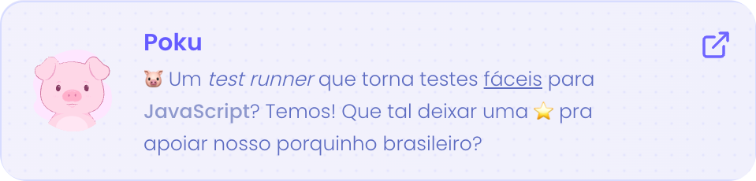
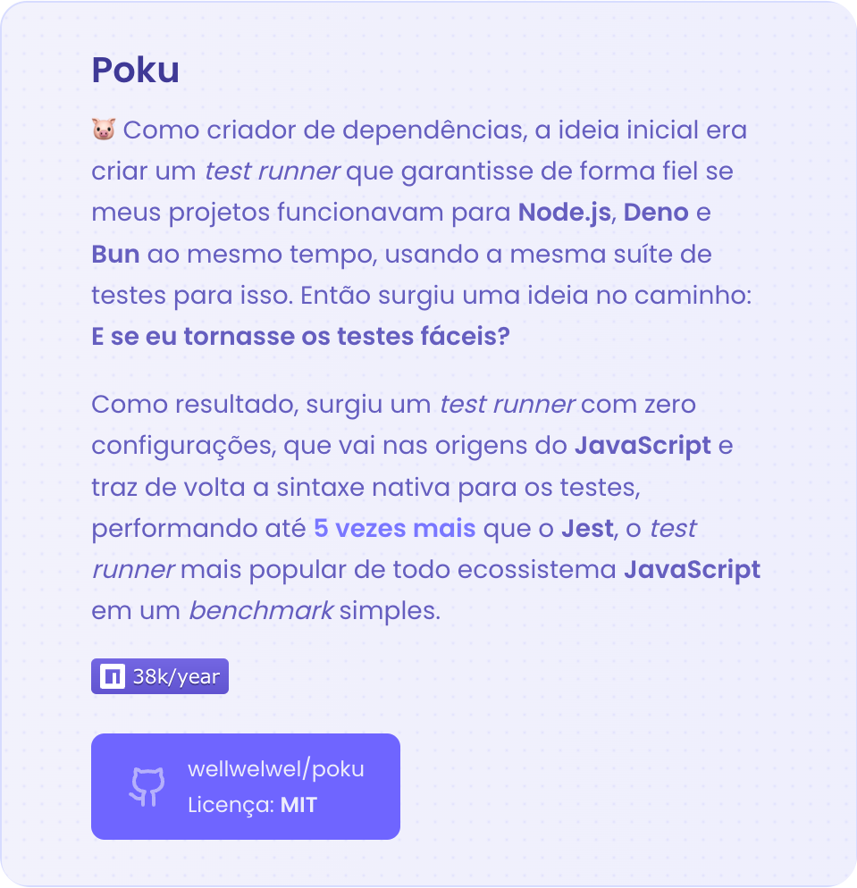

# [weslley.io](https://weslley.io)

[](https://github.com/wellwelwel/weslley.io/blob/main/LICENSE)

🫰🏻 Yep, even my website is open-source and, as a template, you can use and edit it according to your own needs.

> [!TIP]
>
> - Use the [**GitHub Pages**](https://pages.github.com/) to serve your website for free, since it uses **Static Site Generation** (**SSG**).
> - Use your own colors and assets (images, icons, etc.) to make your site unique ✨

> [!IMPORTANT]
> Please be careful not to misuse the [**AGPL-3.0 License**](https://github.com/wellwelwel/weslley.io/blob/main/LICENSE).
>
> In a nutshell, to use this template, your template also needs to have your code open-source and under the same license.
>
> - You are free to change absolutely everything you want, except the license.
> - It's important to mention this repository both in your repository and website.
>
> Just as an example, a simple footnote:
>
> ```md
> This site was built using [weslley.io](https://github.com/wellwelwel/weslley.io) template.
> ```

> [!WARNING]
> 🚧 Still developing the architecture to make the project accessible to the open-source community.

---

## Development

Cleanly install the dependencies:

```bash
npm ci
```

Main commands:

```bash
# To watch your changes in real time:
npm start

# To preview your build:
npm run preview

```

Useful commands for testing:

```bash
# To fix automatic lint errors:
npm run lint:fix

# To check for type errors (doesn't work with MDX files):
npm run typecheck

# To build your website:
npm run build
```

Extra commands:

```bash
# To update all dependencies to their latest minor versions:
npm run update

# To clear all development and build files (useful for cache errors):
npm run clear
```

---

## 👨🏻‍🎨 How to give it your unique touch?

### Headline description

- Path: [`./content/about/headline.mdx`](./content/about/headline.mdx).

### Projects header description

- Path: [`./content/about/projects.mdx`](./content/about/projects.mdx).

### About page

- Path: [`./content/about/page.mdx`](./content/about/page.mdx).

### Settings and Definitions

- [**Docusaurus**](https://github.com/facebook/docusaurus) config file: [./docusaurus.config.ts](./docusaurus.config.ts).
- **Website** config file: [./website.config.ts](./website.config.ts).
- **Theme** (colors and fonts): [./src/css/themes.scss](./src/css/themes.scss).

---

## ⚛️ Components

### `SafeLink`

Opens the link in a new tab with the `noopener` and `noreferrer` options.

Example:

```tsx
import { SafeLink as Link } from '@site/src/components/SafeLink';

<Link to='https://www.linkedin.com/in/wellwelwel/'>My LinkedIn</Link>;
```

- Ideal for external links.

---

### `Social`

Creates a social icon in homepage _(header and footer soon)_:

> <a href="https://www.linkedin.com/in/wellwelwel/"></a>

- Path: `./content/social/`.
  - Example: `./content/social/<file.{mdx,md,tsx,jsx}>`.
- Subdirectories will be ignored.
- Alphabetical order matters, use `01-<name>` to easily organize your social.
  - Example: `./content/social/01-linkedin.mdx`.

Examples:

#### MDX

```mdx
import { Social } from '@site/src/components/Social';

<Social
  name='LinkedIn'
  imageSrc='/img/linkedin.svg'
  url='https://www.linkedin.com/in/wellwelwel/'
/>
```

> [!TIP]
>
> - You can use one file for all social by including one after the other or a file for each one.

#### TSX

```tsx
import { Social } from '@site/src/components/Social';

export default () => (
  <Social
    name='LinkedIn'
    imageSrc='/img/linkedin.svg'
    url='https://www.linkedin.com/in/wellwelwel/'
  />
);
```

> [!TIP]
>
> - You can use one file for all social by grouping them using `<></>` or a file for each one.

---

### `Card`

Creates a card for the highlights section in homepage:

> <a href="https://github.com/wellwelwel/poku"></a>

- Path: `./content/cards/`.
  - Example: `./content/cards/<file.{mdx,md,tsx,jsx}>`.
- Subdirectories will be ignored.
- Alphabetical order matters, use `01-<name>` to easily organize your cards.
  - Example: `./content/cards/01-poku.mdx`.

Examples:

#### MDX

```mdx
import { Card } from '@site/src/components/Card';

<Card
  name='Poku'
  imageSrc='/img/poku.svg'
  url='https://github.com/wellwelwel/poku'
>

🐷 Um _test runner_ que torna testes <ins>fáceis</ins> para **JavaScript**?
Temos!

Que tal deixar uma ⭐️ pra apoiar nosso porquinho brasileiro?

</Card>
```

> [!TIP]
>
> - Use `.mdx` files to easily create your card descriptions using **markdown** syntax at the same time as **React** components.
> - You can use one file for all cards by including one after the other or a file for each one.

#### TSX

```tsx
import { Card } from '@site/src/components/Card';

export default () => (
  <Card
    name='Poku'
    imageSrc='/img/poku.svg'
    url='https://github.com/wellwelwel/poku'
  >
    🐷 Um <em>test runner</em> que torna testes <ins>fáceis</ins> para{' '}
    <strong>JavaScript</strong>? Temos!
    <br />
    Que tal deixar uma ⭐️ pra apoiar nosso porquinho brasileiro?
  </Card>
);
```

> [!TIP]
>
> - You can use one file for all cards by grouping them using `<></>` or a file for each one.

---

### `Project`

Creates a project for the `/projects` page:

> 

- Path: `./content/projects/`.
  - Example: `./content/projects/<file.{mdx,md,tsx,jsx}>`.
- Subdirectories will be ignored.
- Alphabetical order matters, use `01-<name>` to easily organize your projects.
  - Example: `./content/projects/01-poku.mdx`.

Examples:

#### MDX

```mdx
import { Project } from '@site/src/components/Project';
import { SafeLink as Link } from '@site/src/components/SafeLink';

<Project
  name='Poku'
  organization='wellwelwel'
  repository='poku'
  npm='poku'
  license='MIT'
>

🐷 Como criador de dependências, a ideia inicial era criar um _test runner_ que garantisse de forma fiel se meus projetos funcionavam para **Node.js**, **Deno** e **Bun** ao mesmo tempo, usando a mesma suíte de testes para isso. Então surgiu uma ideia no caminho: **E se eu tornasse os testes fáceis?**

Como resultado, surgiu um _test runner_ com zero configurações, que vai nas origens do **JavaScript** e traz de volta a sintaxe nativa para os testes, performando até <Link to='https://github.com/wellwelwel/poku/blob/main/benchmark/README.md'>5 vezes mais</Link> que o **Jest**, o _test runner_ mais popular de todo ecossistema **JavaScript** em um _benchmark_ simples.

</Project>
```

> [!TIP]
>
> - Use `.mdx` files to easily create your project descriptions using **markdown** syntax at the same time as **React** components.
> - You can use one file for all projects by including one after the other or a file for each one.

#### TSX

```tsx
import { Project } from '@site/src/components/Project';
import { SafeLink } from '@site/src/components/SafeLink';

export default () => (
  <Project
    name='Poku'
    organization='wellwelwel'
    repository='poku'
    npm='poku'
    license='MIT'
  >
    <p>
      🐷 Como criador de dependências, a ideia inicial era criar um{' '}
      <em>test runner</em>
      que garantisse de forma fiel se meus projetos funcionavam para{' '}
      <strong>Node.js</strong>,<strong>Deno</strong> e <strong>Bun</strong> ao
      mesmo tempo, usando a mesma suíte de testes para isso. Então surgiu uma
      ideia no caminho: <strong>E se eu tornasse os testes fáceis?</strong>
    </p>
    <p>
      Como resultado, surgiu um <em>test runner</em> com zero configurações, que
      vai nas origens do <strong>JavaScript</strong> e traz de volta a sintaxe
      nativa para os testes, performando até{' '}
      <SafeLink to='https://github.com/wellwelwel/poku/blob/main/benchmark/README.md'>
        5 vezes mais
      </SafeLink>{' '}
      que o <strong>Jest</strong>, o <em>test runner</em> mais popular de todo
      ecossistema
      <strong>JavaScript</strong> em um <em>benchmark</em> simples.
    </p>
  </Project>
);
```

> [!TIP]
>
> - You can use one file for all projects by grouping them using `<></>` or a file for each one.

---

## Acknowledgements

Special thanks:

- 🦖 Under the hood, [**Docusaurus**](https://github.com/facebook/docusaurus) is used. In other words, without it, this project wouldn't even exist.

To create this website, it was used:

- [**TypeScript**](https://github.com/microsoft/TypeScript)
- [**React**](https://github.com/facebook/react) (**TSX**)
- [**Sass**](https://github.com/sass/sass) (**SCSS**)
- [**MDX**](https://github.com/mdx-js/mdx)
- [**Docusaurus**](https://github.com/facebook/docusaurus) (**SSG**)

---

## License

- **weslley.io** source code is under the [**AGPL-3.0**](https://github.com/wellwelwel/weslley.io/blob/main/LICENSE).
- **weslley.io** assets, layout and design (for example, all the contents in [`./content/assets`](./content/assets) and [`./.github/assets`](./.github/assets) directories, images, etc.) are [**Creative Commons**](https://github.com/wellwelwel/weslley.io/blob/main/LICENSE-assets) licensed.
  - Most vectors and icons come and are adapted from [**Freepik**](https://www.freepik.com/) (including personal premium subscription) and [**Lucide**](https://lucide.dev/).

Copyright © 2024-present [Weslley Araújo](https://github.com/wellwelwel).
