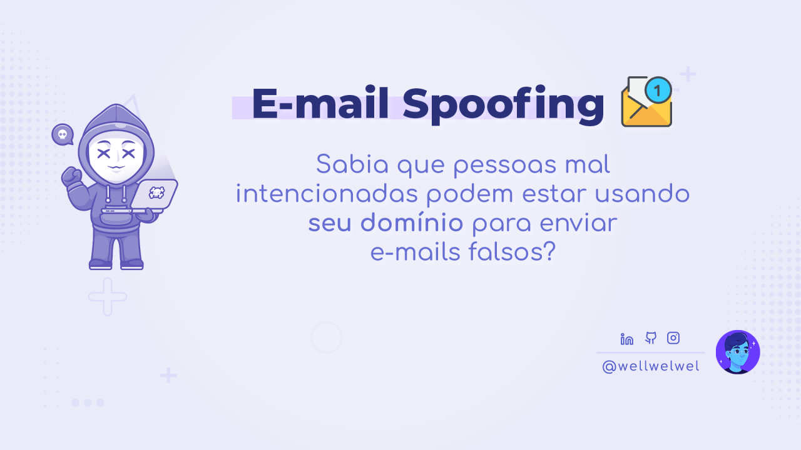

import { Parallax } from '@site/src/components/Parallax';

<Parallax tiltMaxAngleX={0} perspective={1920}>
  
</Parallax>

Sabia que pessoas mal intencionadas podem estar usando seu domínio para enviar e-mails falsos?

{/* truncate */}

Essa técnica é conhecida como E-mail Spoofing e explora a falta de autenticação no envio de e-mails de um domínio, falsificando o remetente e fazendo parecer que a mensagem foi enviada por um domínio confiável.

Tanto empresas pequenas e grandes podem ser alvos, assim como sites pessoais ou abandonados, onde o intuito pode variar desde capturar dados sensíveis e até infectar dispositivos dos usuários. Tudo isso, usando domínios válidos sem autorização.

Os motivos podem variar, mas vou citar alguns super comuns que tornam essa vulnerabilidade possível:

- Falta de conhecimento ou até mesmo negligência.
- O provedor do domínio exige um plano pago à parte para e-mails que o usuário não está disposto a adquirir.

## Possíveis impactos negativos 👾

- Perda de credibilidade.
- Bloqueio por provedores de e-mail (onde até mesmo seus e-mails válidos podem ser afetados ao serem entregues como spam ou nem mesmo chegarem ao destinatário).
- Perda do domínio (denúncias, medidas legais ou até mesmo pela reputação muito prejudicada).

## Como se proteger? 🤝

Nesse artigo, vou abordar tópicos como SPF, DKIM e DMARC para proteger seu domínio e evitar que pessoas maliciosas consigam acesso não autorizado ao seu domínio.

:::tip
Veja também como se proteger do lado do usuário final na publicação do [LinkedIn](https://www.linkedin.com/posts/wellwelwel_j%C3%A1-recebeu-e-mails-falsos-vindos-de-activity-7264430239038992384-skUX/).
:::

### DNS

O **DNS** é onde você configura os registros relacionados ao seu domínio, como subdomínios, redirecionamentos, envio e recebimento de e-mails, entre outros.

Ao comprar um domínio, é comum usuários se preocuparem especialmente com o IP da hospedagem. Aqui é onde mora um dos problemas, pois ao notar que o domínio já está funcionando, o usuário pode considerar que o trabalho já está completo.

Dito isso, vamos conhecer os principais registros relacionados ao e-mail:

### MX (Mail Exchange)

O registro **MX** é o responsável por você receber os e-mails, direcionando-os do seu domínio para o servidor responsável por recebê-los (**Google Workspace**, **Zoho**, etc.).

Sem ele, os e-mails que te enviarem nunca chegarão até você.

### SPF

O registro **SPF** é uma forma de dizer quais servidores estão autorizados a enviar e-mails em nome do seu domínio, ajudando a evitar que pessoas mal intencionadas usem seu domínio.

Ele é especialmente importante contra o E-mail Spoofing, sendo geralmente reforçado pelo parâmetro `~all`.

#### Dica:

Enquanto a maioria dos servidores de e-mail sugerem `~all` devido à flexibilidade, se seu domínio já foi vítima de **E-mail Spoofing** ou você quer reforçar ainda mais sua segurança, você pode usar `-all` para eliminar a possibilidade de aceitação por baixa prioridade de forma estrita, mas note que isso implica na complexidade das configurações do **DNS**, exigindo atualizações manuais sempre que novos serviços de e-mail forem integrados ao seu domínio.

### DKIM

O registro **DKIM** adiciona uma assinatura digital aos e-mails enviados pelo seu domínio, permitindo que o servidor que recebe o seu e-mail verifique se a mensagem foi realmente enviada por você e não foi alterada no caminho, sendo uma ferramenta complementar essencial ao **SPF**.

Isso ajuda a proteger tanto a reputação do seu domínio quanto os destinatários, além de indiretamente evitar que seus e-mails sejam entregues como spam.

### DMARC

O registro **DMARC** permite que você defina como os servidores de e-mail devem tratar mensagens que falharem na validação do SPF e do DKIM, fornecendo relatórios detalhados sobre tentativas indevidas usando seu domínio, permitindo monitorar possíveis abusos.

## Soluções e alternativas gratuitas 🌟

Se seu provedor não possui um servidor de e-mails ou você não pretende usar um plano pago para isso, você pode usar gratuitamente o DNS com o roteamento de e-mails da Cloudflare, redirecionando os e-mails do seu domínio para outro e-mail (por exemplo, um e-mail pessoal do Gmail).

O Zoho também pode ser uma boa alternativa, não sendo necessário redirecionar seus e-mails e oferecendo um dashboard próprio para os e-mails do seu domínio, mas ele possui limitações de recurso em sua versão gratuita.

— Curtiu aprender um pouco mais sobre segurança? 🔐

:::note
Esse artigo não possui nenhum tipo de patrocínio e essas são sugestões que uso tanto pessoalmente, como profissionalmente 🙋🏻
:::

:::info
Esse artigo foi postado icialmente no [LinkedIn](https://www.linkedin.com/pulse/e-mail-spoofing-prevenindo-o-envio-de-emails-atrav%25C3%25A9s-do-ara%25C3%25BAjo-ff2xc/).
:::
