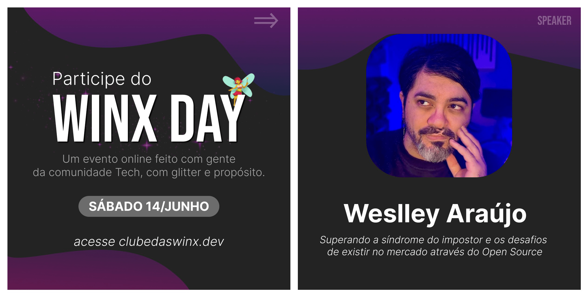

import { Parallax } from '@site/src/components/Parallax';

<Parallax tiltMaxAngleX={0} perspective={1920}>
  
</Parallax>

🎙️ **Palestra:** Superando a síndrome do impostor e os desafios de existir no mercado através do open source.

:::note
Um evento com uma abordagem mais descontraída e realizado através da comunidade do **Discord** para a comunidade de desenvolvedores, com o objetivo de compartilhar experiências e conhecimentos, especialmente para quem está iniciando na área.
:::

{/* truncate */}

Nesse momento em que muitos programadores se sentem inseguros sobre o futuro da área:

- Será que o meu nível é suficiente?
- Eu devo desistir se não conseguir um emprego na minha área?
- Como adquirir experiências se o mercado não me dá oportunidades?
- Afinal, a Inteligência Artificial vai ou não substituir os desenvolvedores?

Trazer tópicos sensíveis como insegurança, complexo de inferioridade e autossabotagem, com uma luz no fim do túnel através da iniciativa open source, foi bem desafiador, mas muito interessante.

Essa é uma palestra onde exponho as inseguranças durante minha trajetória, conversando em um tom próximo ao que seria um desabafo.

O intuito é me conectar com quem está participando, evoluir para aprendizado e, quem sabe, inspirar através da minha história, compartilhando o lado humano que as redes sociais e os "títulos de LinkedIn" não mostram.
