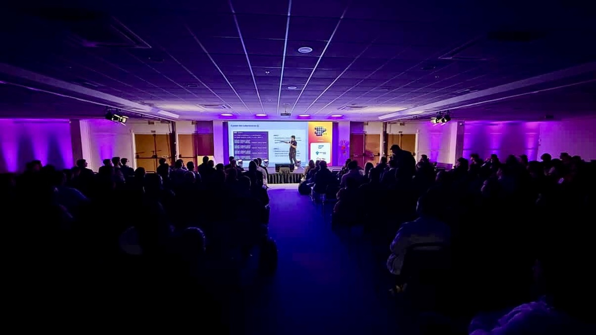

import { Parallax } from '@site/src/components/Parallax';

<Parallax tiltMaxAngleX={0} perspective={1920}>
  
</Parallax>

🎙️ **Palestra:** Criando um Test Runner: O que acontece por trás dos testes?

:::note
Muito se discute sobre testes, mas como é criar um test runner do zero? 
Mais que isso: como se testa um _test runner_?
:::

{/* truncate */}

Nessa palestra, eu desmonto o Poku, o único _test runner_ brasileiro para **JavaScript** e **TypeScript**, que desafia mais de 14 anos da história da linguagem, ao trazer a sintaxe nativa do **JavaScript** para os testes.

Você vai aprender sobre o poder dos subprocessos, isolamento e as vantagens de trabalhar com concorrência. Tudo isso, usando somente recursos nativos da linguagem.

Calma, sintaxe nativa?

Você vai conhecer a história dos testes para **JavaScript** e o motivo do por que testes não seguem o fluxo natural da linguagem, enquanto descobre os bastidores dos _test runners_ mais populares da linguagem.

Esse é o tipo de aprendizado que, independentemente de qual _tester_ você usa, vai mudar a maneira como você vê os testes de verdade.
