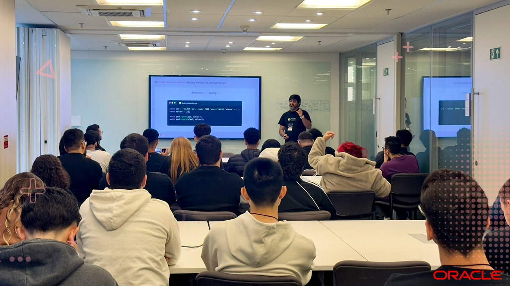

import { Parallax } from '@site/src/components/Parallax';

<Parallax tiltMaxAngleX={0} perspective={1920}>
  
</Parallax>

📹 **Palestra:** Inventando o Novo: o ponto de encontro entre criatividade humana e geração assistida por IA

:::note
Melhorar performance em um sistema legado faz parte da rotina. Inventar algoritmos e uma nova arquitetura inédita é completamente diferente.
:::

{/* truncate */}

Nesta palestra, eu compartilho os bastidores por trás da reconstrução de uma biblioteca crítica do ecossistema open source, o **MySQL2**, para processar bilhões de requisições **MySQL** de forma eficiente.

Vamos passar pelos problemas, ideias, implementações, como ensinar **LLMs** a lidarem com algo novo e, inclusive, pela correção de 4 vulnerabilidades (**CVEs**) críticas em larga escala.

Além disso, você vai conhecer como foi o processo de tornar o maior cliente **MySQL** para **JavaScript** compatível com **TypeScript**, **Bun**, **Deno** e **Cloudflare Workers**.
