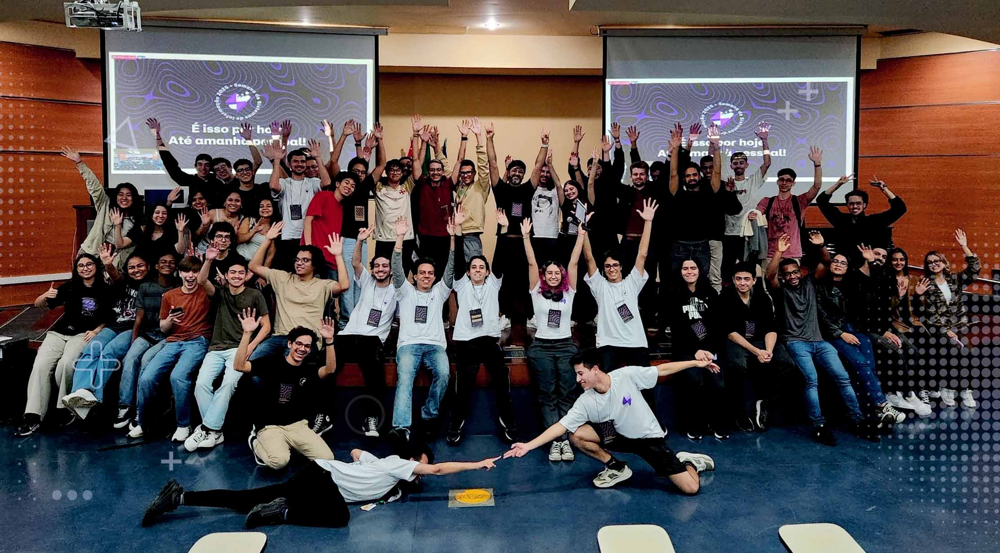

import { Parallax } from '@site/src/components/Parallax';
import { SafeLink } from '@site/src/components/SafeLink';

<Parallax tiltMaxAngleX={0} perspective={1920}>
  
</Parallax>

🎙️ **Keynote:** GitHub além do Código: superando o mercado através do open source

:::note
Palestrar em uma universidade (<SafeLink to="https://www5.each.usp.br/">**USP**</SafeLink>), por si só já é especial, mas encerrar o dia de evento tornou tudo ainda mais especial ✨

O <SafeLink to="https://www.semanadesi.com/">**SSI**</SafeLink> é um evento organizado pelos próprios alunos da universidade e tive o prazer de ser convidado para ensinar através do open source, usando o **GitHub** como ferramenta de estudo.
:::

{/* truncate */}

Com foco em como se destacar em um mercado cada vez mais competitivo, mostro como o open source pode avançar sua evolução técnica, permitindo alcançar conquistas inimagináveis que refletem diretamente na carreira profissional.

Em um mercado cada vez mais competitivo, o open source não é só sobre código — é uma ponte direta para crescimento técnico, visibilidade global e oportunidades reais na carreira.

Com exemplos visuais, humanos e reais, quero te inspirar e trazer uma visão cada vez mais otimista de si em um mundo cada vez mais intimidador, especialmente com a chegada das inteligências artificiais, usando o open source estrategicamente para construir credibilidade e confiança no mercado.
