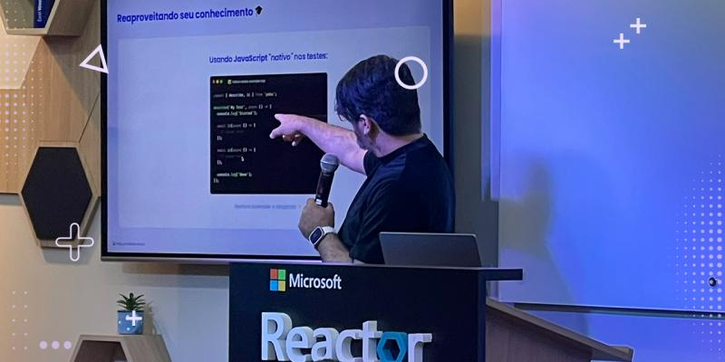

import { Parallax } from '@site/src/components/Parallax';

<Parallax tiltMaxAngleX={0} perspective={1920}>
  
</Parallax>

🎙️ **Palestra:** Criando um Test Runner Multi-Plataforma de Alta Performance.

{/* truncate */}

Com o tema "API Like a Boss", tive a oportunidade de ensinar através do [**Poku**](https://github.com/wellwelwel/poku).

O foco da palestra consistiu na importância de delegar as responsabilidades de cada problema usando recursos nativos do **Node.js**.

Ao invés de apenas falar do Poku em si, também usei o Poku como uma analogia, ensinando sobre sub-processos e diferenças entre **Node.js**, **Bun** e **Deno**.

:::tip

[Veja o slide utilizado na palestra 🐷](https://drive.google.com/file/d/16XxIt_pov5aBidGjIwC4V_riYq3PMlrB/view)

:::
