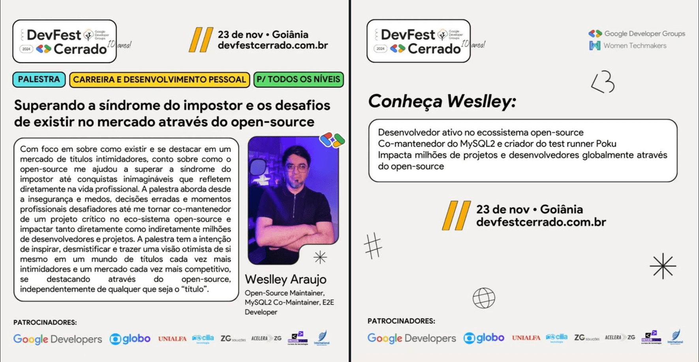
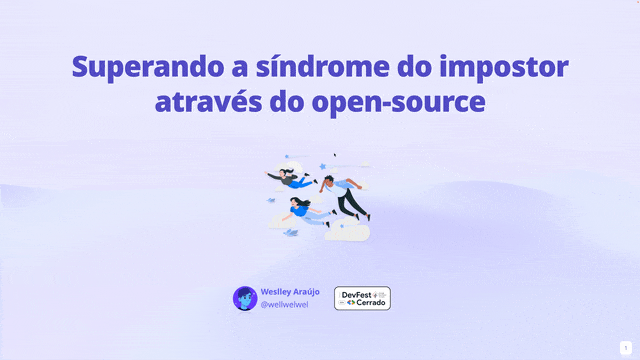

import { Parallax } from '@site/src/components/Parallax';

<Parallax tiltMaxAngleX={0} perspective={1920}>
  
</Parallax>

🎙️ **Talk:** Overcoming the impostor syndrome and the challenges of existing in the industry through open-source.

{/* truncate */}

## 💡 A escolha do tema

Nesse momento em que muitos programadores se sentem inseguros sobre o futuro da área:

- Será que o meu nível é suficiente?
- Eu devo desistir se não conseguir um emprego na minha área?
- Como adquirir experiências se o mercado não me dá oportunidades?

Trazer tópicos sensíveis como insegurança, complexo de inferioridade e autossabotagem, com uma luz no fim do túnel através da iniciativa open-source, foi bem desafiador, mas muito interessante.

## 🧑🏻‍🔬 O desenvolvimento

Eu poderia facilmente explicar o que é síndrome do impostor e ir direto para a “solução”, mas optei pelo caminho mais difícil:

— Expor minhas fraquezas durante minha trajetória, conversando em um tom próximo ao que seria um desabafo.

O intuito era me conectar com quem estivesse ali, evoluir para aprendizado e, quem sabe, inspirar através da minha história, compartilhando o lado humano que as redes sociais e os "títulos de LinkedIn" não mostram.

## 👻 Os desafios

Falar sobre nossas falhas e inseguranças para pessoas que nem nos conhecem é mais complicado do que parece, as pessoas gostam de ouvir alguém que elas possam admirar.

Mas os comentários e o carinho das pessoas que vieram falar comigo no final, me mostraram que a ideia de me conectar com quem estava ali não só deu certo, mas que realmente serviu de inspiração para algumas pessoas e isso me deixou muito feliz ✨

## 🎤 A palestra

Fiquei pensativo se as pessoas se interessariam por esse tema, mas aos poucos a sala foi ficando cheia e uma pessoa até sentou no chão no comecinho.

Originalmente, a apresentação tinha alguns estudos complementares, incluindo telas práticas com contribuições open-source reais, mas precisei adaptar algumas coisas pra caber no formato e tempo do evento**.**

:::tip

Spoiler (GIF) do slide utilizado na palestra:

:::
