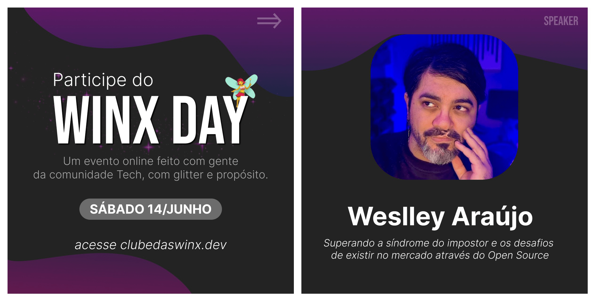

import { Parallax } from '@site/src/components/Parallax';

<Parallax tiltMaxAngleX={0} perspective={1920}>
  
</Parallax>

🎙️ **Talk:** Overcoming impostor syndrome and the challenges of existing in the market through open source.

:::info
An event with a more relaxed approach held through the **Discord** community for the developer community, aiming to share experiences and knowledge, especially for those starting in the field.
:::

{/* truncate */}

At this moment when many developers feel insecure about the future of the field:

- Is my level sufficient?
- Should I give up if I can't get a job in my field?
- How do I gain experience if the market doesn't give me opportunities?
- After all, will Artificial Intelligence replace developers or not?

Bringing up sensitive topics like insecurity, inferiority complex, and self-sabotage, with a light at the end of the tunnel through open source initiatives, was quite challenging but very interesting.

This is a talk where I expose the insecurities during my journey, speaking in a tone close to what would be a heartfelt confession.

The intention is to connect with those participating, evolve toward learning, and perhaps inspire through my story, sharing the human side that social networks and "LinkedIn titles" don't show.
