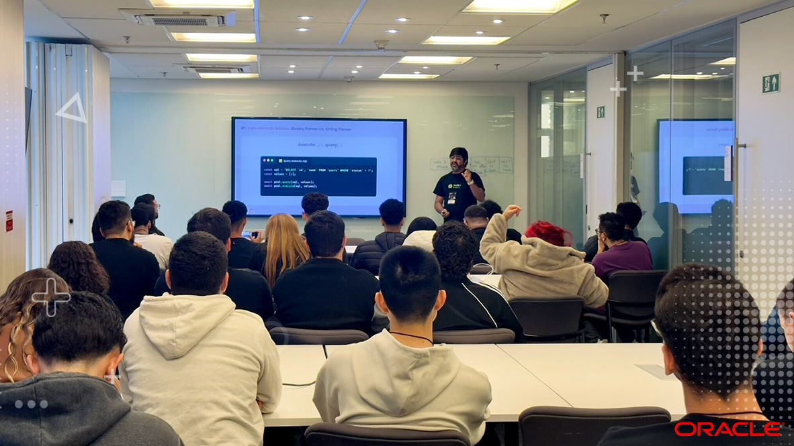

import { Parallax } from '@site/src/components/Parallax';

<Parallax tiltMaxAngleX={0} perspective={1920}>
  
</Parallax>

🎙️ **Talk:** Inventing the New: The Meeting Point Between Human Creativity and AI-Assisted Generation

:::note Summary
Improving performance in a legacy system is part of the routine. Inventing algorithms and a brand-new architecture is something completely different.
:::

{/* truncate */}

In this talk, I share the behind-the-scenes of rebuilding a critical open source ecosystem library, **MySQL2**, to efficiently process billions of **MySQL** requests.

We'll go through the problems, ideas, implementations, how to teach **LLMs** to handle something new, and even the remediation of 4 large-scale critical vulnerabilities (**CVEs**).

Additionally, you'll learn about the process of making the largest **MySQL** client for **JavaScript** compatible with **TypeScript**, **Bun**, **Deno**, and **Cloudflare Workers**.
