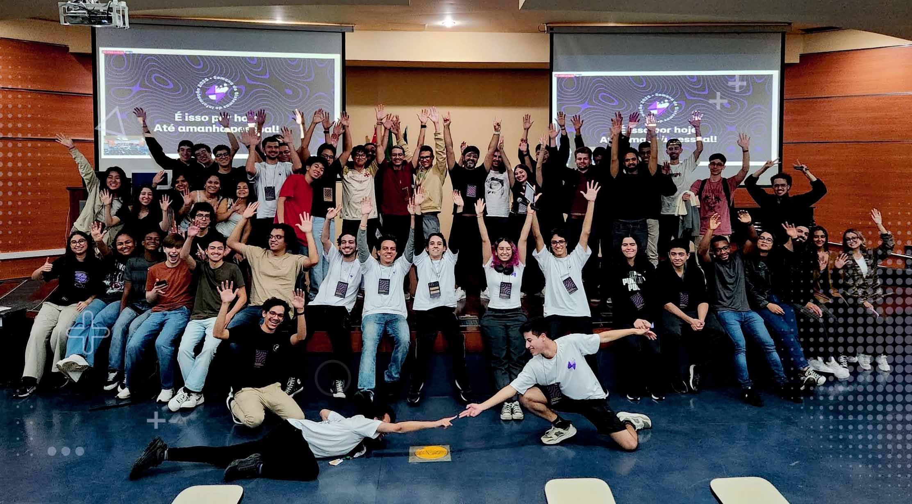

import { Parallax } from '@site/src/components/Parallax';
import { SafeLink } from '@site/src/components/SafeLink';

<Parallax tiltMaxAngleX={0} perspective={1920}>
  
</Parallax>

🎙️ **Keynote:** GitHub Beyond Code: overcoming in the job market through open source

:::note
Speaking at a university (<SafeLink to="https://www5.each.usp.br/">**USP**</SafeLink>) is special in itself, but closing the day's event made it even more special ✨

The <SafeLink to="https://www.semanadesi.com/">**SSI**</SafeLink> is an event organized by the university students themselves, and I had the pleasure of being invited to teach through open source, using **GitHub** as a learning tool.
:::

{/* truncate */}

Focusing on how to stand out in an increasingly competitive market, I show how open source can accelerate your technical growth, enabling you to achieve unimaginable milestones that directly impact your professional career.

In a market that is more competitive every day, open source is not just about code — it’s a direct bridge to technical growth, global visibility, and real career opportunities.

With visual, human, and real examples, I want to inspire you and bring an optimistic perspective of yourself in an increasingly intimidating world, especially with the rise of artificial intelligence, using open source strategically to build credibility and trust in the market.
